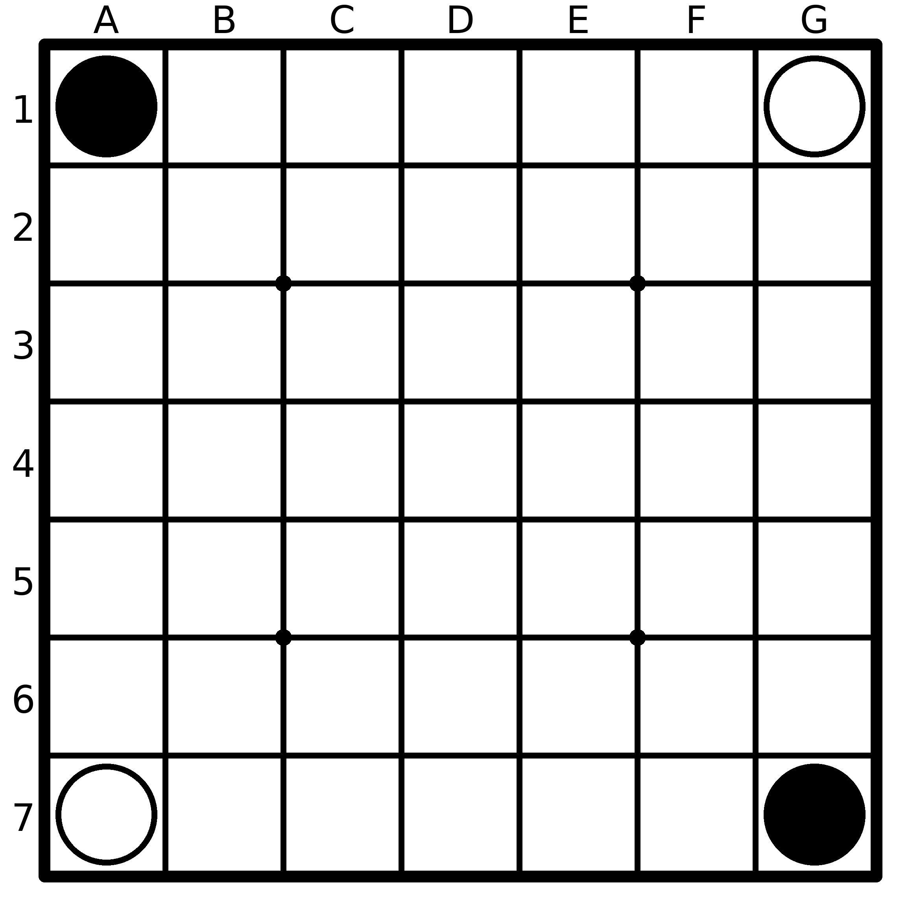
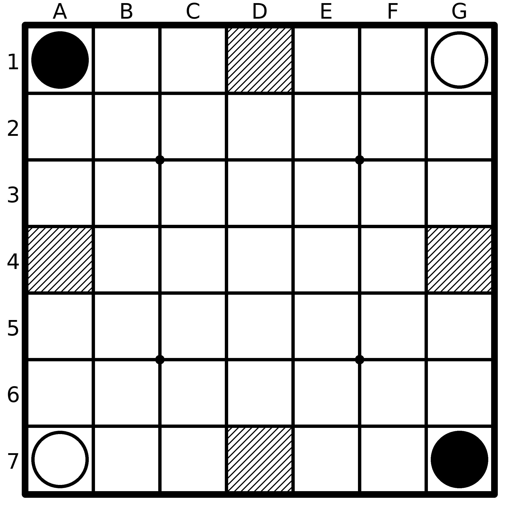
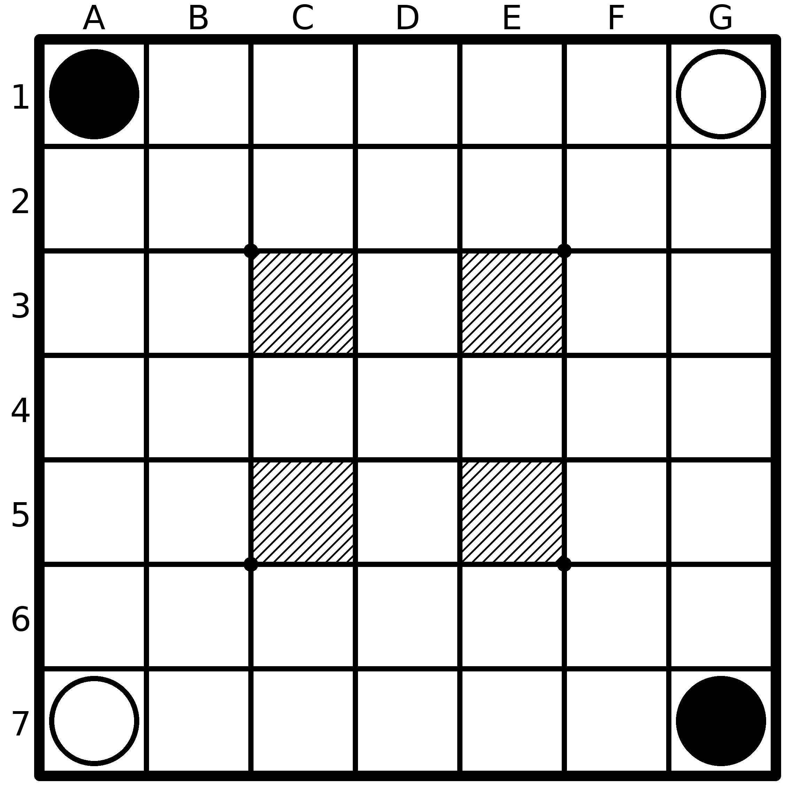

# Ataxx Board Image Generator
Generates an image representing an ataxx board given a fen string

## Usage
```bash
python3 src/main.py <scale> <fen>
```

## Examples
### x5o/7/7/7/7/7/o5x x 0 1

### x2-2o/7/7/-5-/7/7/o2-2x x 0 1

### x5o/7/2-1-2/7/2-1-2/7/o5x x 0 1
